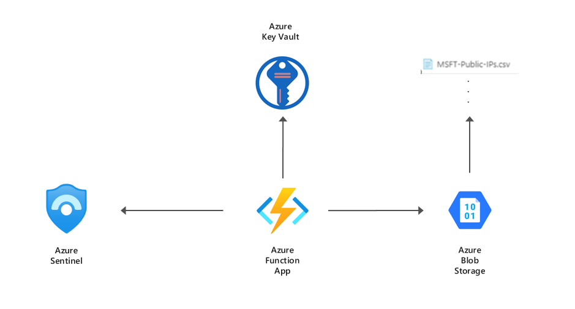

# Sentinel Custom Watchlist Import

## Overview
This repository provides a custom watchlist import solution which can be used to work around [Sentinels native watchlist](https://docs.microsoft.com/en-us/azure/sentinel/watchlists#create-a-new-watchlist) file import size limitation of 3.8 MB.

The custom import process is as follows:
1. A CSV file with the naming convention "watchlist_[LOG_ANALYTS_TABLE_NAME].csv" is dropped into the "incoming" Blob Storage container.
1. The Azure Function (ImportWatchlistDaily) is scheduled to run once a day on a CRON schedule "0 * 0 * * *", once triggered the function checks the "incoming" container for new watch lists.
1. When a new watch list arrives the contents of the file is hashed and it is converted to JSON, each row is inserted into a table in the Log Analytics Workspace. 
1. When querying the data we can use the file hash to group related rows which were imported from the same source.

# Requirements
- Azure CLI 2.x
- Azure Functions Core Tools 3.x
- Bicep CLI 0.4.x

# Deployment Steps
Run the provided Shell script

- ./deploy.sh [RESOURCE_GROUP] [LOCATION] [STORAGE_ACCOUNT_NAME] [STORAGE_ACCOUNT_SUBSCRIPTION_ID] [WATCHLIST_WORKSPACE_ID] [WATCHLIST_WORKSPACE_SHARED_KEY] 

or manually execute the deployment using the steps below:

1. az group create --name [RESOURCE_GROUP] --location [LOCATION]
2. az bicep build --file .\main.bicep
3. az deployment group create --name [DEPLOYMENT_NAME] --resource-group [RESOURCE_GROUP] --template-file main.json --parameters watchlistStorageAccountName=[STORAGE_ACCOUNT_NAME] --parameters watchlistStorageSubscriptionId=[STORAGE_ACCOUNT_SUBSCRIPTION_ID]  --parameters watchlistWorkspaceId=[WATCHLIST_WORKSPACE_ID] --parameters workspaceSharedKey=[WATCHLIST_WORKSPACE_SHARED_KEY] 
4. cd functionapp/
5. func azure functionapp publish [FUNCTION_APP_NAME]