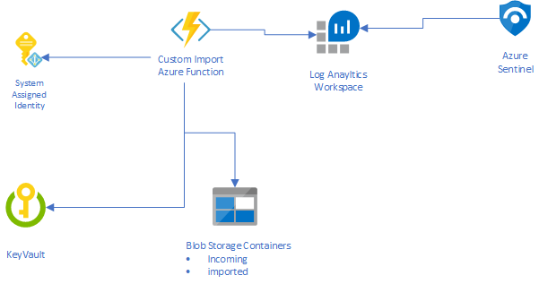

# Sentinel Custom Watchlist Import

## Overview
This repository provides a custom watchlist import solution which can be used to work around [Sentinels native watchlist](https://docs.microsoft.com/en-us/azure/sentinel/watchlists#create-a-new-watchlist) file import size limitation of 3.8 MB.



The custom import process is as follows:
1. A CSV file with the naming convention "watchlist_[LOG_ANALYTICS_TABLE_NAME].csv" is dropped into the "incoming" Blob Storage container.
1. The Azure Function (ImportWatchlistDaily) is scheduled to run once a day on a CRON schedule "0 * 0 * * *", once triggered the function checks the "incoming" container for new watchlists.
1. When a new watchlist arrives the contents of the file is hashed and the rows are converted to JSON, each row is inserted into a custom table in the Log Analytics Workspace. 
1. Once the file is processed it is moved to the "imported" Blob Storage Container.
1. When querying the data we can use the TimeGenerated property to group related rows which were imported at the same time.

# Requirements
- Azure CLI 2.x
- Azure Functions Core Tools 3.x
- Bicep CLI 0.4.x
- ARMClient 1.9.x

# Deployment Steps
Run the provided Shell script

- ./deploy.sh [RESOURCE_GROUP] [LOCATION] [STORAGE_ACCOUNT_NAME] [STORAGE_ACCOUNT_SUBSCRIPTION_ID] [WATCHLIST_WORKSPACE_ID] [WATCHLIST_WORKSPACE_SHARED_KEY] 

or manually execute the deployment using the steps below:

1. az group create --name [RESOURCE_GROUP] --location [LOCATION]
2. az bicep build --file .\main.bicep
3. az deployment group create --name [DEPLOYMENT_NAME] --resource-group [RESOURCE_GROUP] --template-file main.json --parameters watchlistStorageAccountName=[STORAGE_ACCOUNT_NAME] --parameters watchlistStorageSubscriptionId=[STORAGE_ACCOUNT_SUBSCRIPTION_ID]  --parameters watchlistWorkspaceId=[WATCHLIST_WORKSPACE_ID] --parameters workspaceSharedKey=[WATCHLIST_WORKSPACE_SHARED_KEY] 
4. cd functionapp/
5. func azure functionapp publish [FUNCTION_APP_NAME]


# Azure Sentinel
In Azure Sentinel we are able to leverage [Watchlists in our analytics rules](https://docs.microsoft.com/en-us/azure/sentinel/watchlists#use-watchlists-in-analytics-rules), the queries will look something like the following : 

```sql
let watchlist = (_GetWatchlist('ipwatchlist') | project IPAddress);
Heartbeat
| where ComputerIP in (watchlist)
```

When working with our custom watchlists we are able to perform the same thing although the queries will be slightly different. For example here is the same query but it retrieves its data from our custom table in Log Analytics. We take care to retrieve only the latest imported records, we do this by leveraging the TimeGenerated property.

```sql
let MaxTimeGenerated = toscalar(customipwatchlist_CL | summarize Latest=max(TimeGenerated));
let customwatchlist = (customipwatchlist_CL | where TimeGenerated == MaxTimeGenerated | project IPAddress);
Heartbeat
| where ComputerIP in (customwatchlist)
```

It is also recommended that you set the [data retention on the custom table](https://docs.microsoft.com/en-us/azure/azure-monitor/logs/manage-cost-storage#retention-by-data-type) to a reasonable value to avoid unnecessary data duplication:

```powershell
armclient PUT /subscriptions/[SUBSCRIPTION_ID]/resourceGroups/[RESOURCE_GROUP_NAME]/providers/Microsoft.OperationalInsights/workspaces/[WORKSPACE_NAME]/Tables/[LOG_ANALYTICS_TABLE_NAME]?api-version=2017-04-26-preview "{properties: {retentionInDays: 4}}"
```